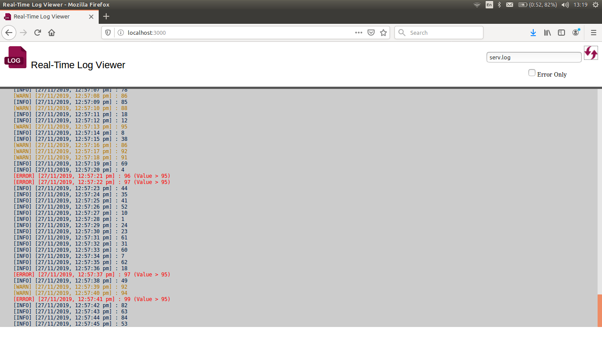

# realtime-log-viewer
This tool can be used to view logs in the browser in real-time.
It is built using `socket.io` in NodeJS.

## Log Generator
Log Generator `log-generator.js` is a node.js script to create log in a file called `serv.log`.

### How to Run
Run `node log_generator.js` in command line.

## Log Viewer
Log viewer `log_viewer.js` creates the server which will run on the port 3000 and will show the log in real-time.

### How to Run
Run `node log_viewer.js` to create the server on the port 3000.
Open the browser and go to `http://127.0.0.1:3000/` or `localhost:3000` to view the real-time logger.

## Screenshot

